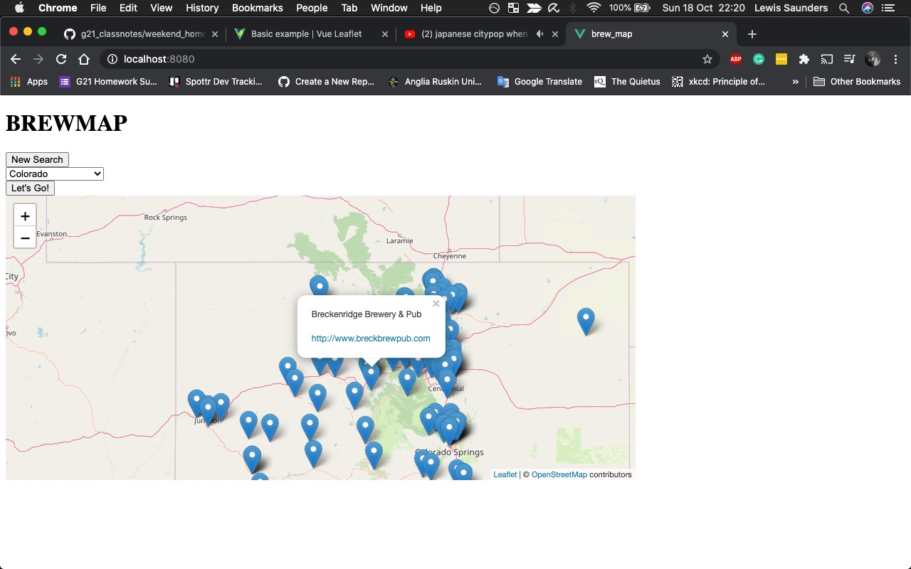
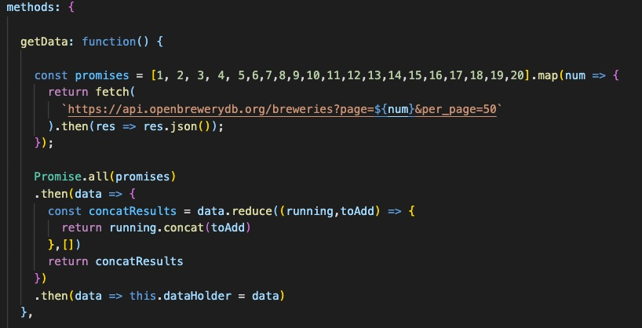

# brew_map

this is a project which requests data about USA breweries from the OpenBreweryDB API (https://www.openbrewerydb.org/) and then presents the returned data on a Leaflet map. It is possible to search the breweries by state, which will return a new and more detailed map of the state's breweries.

An example of results returned by searching a state


The code used to make several requests to the OpenBreweries API at once. This is necessary because the API will only return up to 50 results per request.


## Project setup
```
npm install
```

### Compiles and hot-reloads for development
```
npm run serve
```

### Compiles and minifies for production
```
npm run build
```

### Run your unit tests
```
npm run test:unit
```

### Run your end-to-end tests
```
npm run test:e2e
```

### Customize configuration
See [Configuration Reference](https://cli.vuejs.org/config/).
